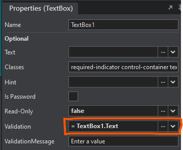
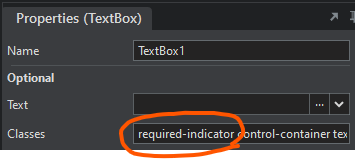
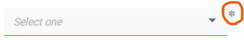

# Validation Expressions Cheat Sheet <!-- omit in toc -->

The release of Stadium 6.12 brings some changes to how field validations work in Stadium. Instead of a simple selection from a predefined set of limited options, we can now use expressions to flexibly validate control values and properties as well as the values and properties of related controls. 

This readme describes how to implement validations currently built into the field validations checkbox list in Stadium and how to add a number of other validations. When upgrading a pre- 6.12 application in the 6.12 Stadium Designer, older validations will automatically be upgraded. 

## Contents <!-- omit in toc -->
- [Stadium Version](#stadium-version)
- [Required / Not Required](#required--not-required)
  - [Required TextBox, DatePicker, DropDown \& RadioButtonList (Strings)](#required-textbox-datepicker-dropdown--radiobuttonlist-strings)
  - [Required CheckBoxList (List Selection)](#required-checkboxlist-list-selection)
  - [Required field indicator \*](#required-field-indicator-)
  - [Not required](#not-required)
- [Regular Expressions](#regular-expressions)
  - [IsEmail](#isemail)
  - [IsAmount](#isamount)
  - [IsNumber](#isnumber)
  - [IsURL](#isurl)
  - [Text length is 8 or more](#text-length-is-8-or-more)
  - [Password validation](#password-validation)
  - [Characters only](#characters-only)
  - [Use AI to generate a RegEx](#use-ai-to-generate-a-regex)
- [Date Validations](#date-validations)
  - [Date Range (DatePicker)](#date-range-datepicker)

## Stadium Version
Ths readme applies to Stadium versions 6.12+

## Required / Not Required
By default no control properties are validated. 

### Required TextBox, DatePicker, DropDown & RadioButtonList (Strings)
When a string property is required, the "IsValid Rule" can simply reference the property to be validated. JavaScript will return *false* when the property contains no value and when the property is null or undefined.

**Format**
```javascript
ControlName.PropertyName
```

**Required Strings Examples**
```javascript
TextBox.Text
DatePicker.Date
DropDown.SelectedOption.value
RadioButtonList.SelectedOption.value
```



### Required CheckBoxList (List Selection)
When a selection from a List is required, we can check the length of the selected options list.

**Required List Example**
```javascript
CheckBoxList.SelectedOptions.length > 0
```

### Required field indicator *
To append a * to a form field, add the class "required-indicator" to the classes list of the control

**Properties Panel Class**



**Result**



### Not required
If a field is not required, but optionally provided values must conform to a specific format, then the expression must be true when either:
1. The property value is empty, null or undefined
2. The property value conforms to a specific format

In this case, two expressions must be combined with a double-pipe (OR). The first expression is true if there is no value, and the second expression is true if there is a value in the required format. For example:
```javascript
!TextBox.Text || TextBox.Text.length > 8
```

## Regular Expressions
A wide range of string validations can be performed using regular expressions

### IsEmail
Required
```javascript
TextBox.Text && /^(([^<>()[\]\\.,;:\s@"]+(\.[^<>()[\]\\.,;:\s@"]+)*)|.(".+"))@((\[[0-9]{1,3}\.[0-9]{1,3}\.[0-9]{1,3}\.[0-9]{1,3}\])|(([a-zA-Z\-0-9]+\.)+[a-zA-Z]{2,}))$/.test(TextBox.Text)
```

Not required
```javascript
!TextBox.Text || /^(([^<>()[\]\\.,;:\s@"]+(\.[^<>()[\]\\.,;:\s@"]+)*)|.(".+"))@((\[[0-9]{1,3}\.[0-9]{1,3}\.[0-9]{1,3}\.[0-9]{1,3}\])|(([a-zA-Z\-0-9]+\.)+[a-zA-Z]{2,}))$/.test(TextBox.Text)
```

### IsAmount
Required
```javascript
TextBox.Text && /^\d+(\.\d{1,2})?$/.test(TextBox.Text)
```

Not required
```javascript
!TextBox.Text || /^\d+(\.\d{1,2})?$/.test(TextBox.Text)
```
### IsNumber
Required
```javascript
TextBox.Text && /^\d+$/.test(TextBox.Text)
```

Not required
```javascript
!TextBox.Text || /^\d+$/.test(TextBox.Text)
```

### IsURL
Required & with http / https
```javascript
TextBox.Text && /https?:\/\/[-a-z0-9@:%._\+~#=]{1,256}\.[a-z0-9()]{1,6}\b([-a-z0-9()@:%_\+.~#?&//=]*)/i.test(TextBox.Text)
```

Required & without http / https
```javascript
TextBox.Text && /[-a-zA-Z0-9@:%._\+~#=]{1,256}\.[a-zA-Z0-9()]{1,6}\b([-a-zA-Z0-9()@:%_\+.~#?&//=]*)/i.test(TextBox.Text)
```

### Text length is 8 or more
Required
```javascript
TextBox.Text && TextBox.Text.length > 7
```

Not required
```javascript
!TextBox.Text || TextBox.Text.length > 7
```

### Password validation
Rules: 8 – 16 characters, at least one number, at least one special character
```javascript
TextBox.Text && /^(?=.*[\d])(?=.*[!@#$%^&*])[\w!@#$%^&*]{8,16}$/.test(TextBox.Text)
```

### Characters only
Required
```javascript
TextBox.Text && /^[a-zA-Z]*$/.test(TextBox.Text)
```

Not required
```javascript
!TextBox.Text || /^[a-zA-Z]*$/.test(TextBox.Text)
```

### Use AI to generate a RegEx
Regular Expressions are hard. If you need a specific RegEx, but are not sure how to write it, I came across a function in the Google Gemini AI tool that will generate a RegEx from a text prompt. 

[Google AI Studio RegEx Text Prompt](https://aistudio.google.com/app/prompts/regexed)

Here is an example prompt for a complex RegEx:

```text
Give me a JavaScript regex that checks a string for the following:
The string must have 8-24 characters.
The string must contain upper and lowercase characters.
The string must contain at least one number.
The string must have at least one of the following special characters: ~!@#$%^&*()_+=-:;<,>.?
```

The result:
```javascript
/^(?=.*[a-z])(?=.*[A-Z])(?=.*\d)(?=.*[~!@#$%^&*()_+=-:;<,>.?]).{8,24}$/
```

Implementing this as a Stadium Validation:

Required
```javascript
TextBox.Text && /^(?=.*[a-z])(?=.*[A-Z])(?=.*\d)(?=.*[~!@#$%^&*()_+=-:;<,>.?]).{8,24}$/.test(TextBox.Text)
```

Not required
```javascript
!TextBox.Text || /^(?=.*[a-z])(?=.*[A-Z])(?=.*\d)(?=.*[~!@#$%^&*()_+=-:;<,>.?]).{8,24}$/.test(TextBox.Text)
```

## Date Validations

### Date Range (DatePicker)
Required & date between Jan 1, 2023 & today
```javascript
DatePicker.Date && DatePicker.Date > new Date('01/01/2023') && DatePicker.Date < new Date()
```

Not required & date between Jan 1, 2023 & yesterday
```javascript
!DatePicker.Date || DatePicker.Date > new Date('01/01/2023') && DatePicker.Date < dayjs(new Date()).add(-1, 'day')
```

