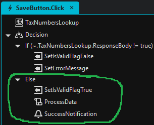

# Validation Expressions Cheat Sheet <!-- omit in toc -->

This readme describes how to create validations in Stadium 6.12+. 

## Contents <!-- omit in toc -->
- [Overview](#overview)
  - [Stadium Version](#stadium-version)
- [Required / Not Required](#required--not-required)
- [IsValid](#isvalid)
  - [IsValid Rule](#isvalid-rule)
  - [Copy-and-Paste Expressions](#copy-and-paste-expressions)
    - [IsEmail](#isemail)
    - [IsAmount](#isamount)
    - [IsNumber](#isnumber)
    - [IsURL](#isurl)
    - [Text length is 8 or more](#text-length-is-8-or-more)
    - [Password validation](#password-validation)
    - [Characters only](#characters-only)
  - [Use AI to generate a RegEx](#use-ai-to-generate-a-regex)
  - [Date Range (DatePicker)](#date-range-datepicker)
  - [Number Range](#number-range)
  - [Combining criteria](#combining-criteria)
- [Script-Based Validations](#script-based-validations)

# Overview

The release of Stadium 6.12 brings some changes to how Control validations work in Stadium. Instead of a simple selection from a limited set of predefined options, we can now use expressions to flexibly validate control values and properties as well as the values and properties of related controls. 

Full feature set:

1. Custom validation definition using Javascript expressions
2. Custom error message definition
3. Programmatic error state setting
4. Programmatic error message definition

When upgrading a pre- 6.12 application in the 6.12 Stadium Designer, older validations will automatically be upgraded. 

## Stadium Version
6.12+

# Required / Not Required
To mark a Control as required, check the "Required" checkbox and enter a validation message


# IsValid
The "IsValid" property is a boolean flag that defines when Controls are in an error state. This property is "true" by default and is set to "false" when it fails an "IsValid Rule". It can also be set [programmatically in scripts](#creating-validations-in-scripts). 

## IsValid Rule
The "IsValid Rule" property accepts a Javascript expression. If the Control value passes the expression the IsValid property is true and the Control has passed the validation. If the Control value does not pass the expression the IsValid property is false, the Control is placed in an error state and the error message is displayed under the Control. 

## Copy-and-Paste Expressions
A wide range of validations can be performed with the help of regular expressions. However, regular expressions are not always easy to write. Below are regular expressions for all current Stadium validations. 

To use these examples, adjust the Control name ("TextBox" in this example) and copy & paste any of these expressions into the "IsValid" rule in the properties panel

### IsEmail
```javascript
/^(([^<>()[\]\\.,;:\s@"]+(\.[^<>()[\]\\.,;:\s@"]+)*)|.(".+"))@((\[[0-9]{1,3}\.[0-9]{1,3}\.[0-9]{1,3}\.[0-9]{1,3}\])|(([a-zA-Z\-0-9]+\.)+[a-zA-Z]{2,}))$/.test(TextBox.Text)
```

### IsAmount
```javascript
/^\d+(\.\d{1,2})?$/.test(TextBox.Text)
```

### IsNumber
```javascript
/^\d+$/.test(TextBox.Text)
```

### IsURL
With http / https
```javascript
/https?:\/\/[-a-z0-9@:%._\+~#=]{1,256}\.[a-z0-9()]{1,6}\b([-a-z0-9()@:%_\+.~#?&//=]*)/i.test(TextBox.Text)
```

### Text length is 8 or more
```javascript
TextBox.Text.length > 7
```

### Password validation
Rules: 8 – 16 characters, at least one number, at least one special character
```javascript
/^(?=.*[\d])(?=.*[!@#$%^&*])[\w!@#$%^&*]{8,16}$/.test(TextBox.Text)
```

### Characters only
```javascript
/^[a-zA-Z]*$/.test(TextBox.Text)
```

## Use AI to generate a RegEx
If you need a specific RegEx, but are not sure how to write it, I came across a function in the Google Gemini AI tool that will generate a RegEx from a text prompt. 

[Google AI Studio RegEx Text Prompt](https://aistudio.google.com/app/prompts/regexed)

Here is an example prompt for a complex RegEx:

```text
Give me a JavaScript regex that checks a string for the following:
The string must have 8-24 characters.
The string must contain upper and lowercase characters.
The string must contain at least one number.
The string must have at least one of the following special characters: ~!@#$%^&*()_+=-:;<,>.?
```

The result:
```javascript
/^(?=.*[a-z])(?=.*[A-Z])(?=.*\d)(?=.*[~!@#$%^&*()_+=-:;<,>.?]).{8,24}$/
```

Implementing this as a Stadium Validation:

```javascript
/^(?=.*[a-z])(?=.*[A-Z])(?=.*\d)(?=.*[~!@#$%^&*()_+=-:;<,>.?]).{8,24}$/.test(TextBox.Text)
```

## Date Range (DatePicker)
Date between Jan 1, 2023 & today
```javascript
DatePicker.Date >= new Date('01/01/2023') && DatePicker.Date <= new Date()
```

## Number Range
Number between 1 and 12
```javascript
TextBox.Text > 0 && TextBox.Text < 13
```

## Combining criteria
When values from one or from more Controls are required to adhere to multiple criteria (x AND y), the criteria can be combined by adding a double ampersand (&&)

```javascript
CheckBox.Checked && DatePicker.Date >= new Date('01/01/2023')
```

When values from one or from more Controls are required to adhere to **any** listed criteria (x OR y), the criteria can be combined by adding a double pipe (||)

```javascript
new Date(DatePicker.Date).getFullYear() == 2024 || new Date(DatePicker.Date).getFullYear() == 2025
```

# Script-Based Validations

Validation errors can be triggered in scripts by setting "IsValid" flags and "Error Text" properties using *SetValue* actions. 

If an "IsValid" flag is set to "false", the text provided in the "Error Text" property is shown under the field. The "IsValid" flag will remain "false" until it is set to "true" using another *SetValue* action. 

Scripts execute once all controls pass the "IsValid Rules". Script executions do **NOT** stop when an "IsValid" flag is set to "false". Data processing may need to be done conditionally as shown. 

